#**Behavioral Cloning** 
---

**Behavioral Cloning Project**

The goals / steps of this project are the following:
* Use the simulator to collect data of good driving behavior
* Build, a convolution neural network in Keras that predicts steering angles from images
* Train and validate the model with a training and validation set
* Test that the model successfully drives around track one without leaving the road
* Summarize the results with a written report


[//]: # (Image References)

[image1]: ./examples/placeholder.png "Model Visualization"
[image2]: ./examples/placeholder.png "Grayscaling"
[image3]: ./examples/placeholder_small.png "Recovery Image"
[image4]: ./examples/placeholder_small.png "Recovery Image"
[image5]: ./examples/placeholder_small.png "Recovery Image"
[image6]: ./examples/placeholder_small.png "Normal Image"
[image7]: ./examples/placeholder_small.png "Flipped Image"

## Rubric Points
###Here I will consider the [rubric points](https://review.udacity.com/#!/rubrics/432/view) individually and describe how I addressed each point in my implementation.  

---
###Files Submitted & Code Quality

####1. Submission includes all required files and can be used to run the simulator in autonomous mode

My project includes the following files:
* model.py containing the script to create and train the model
* drive.py for driving the car in autonomous mode
* run.bat for controlling the model.py file
* model.h5 containing a trained convolution neural network 
* writeup_report.md or writeup_report.pdf summarizing the results

####2. Submssion includes functional code
Using the Udacity provided simulator and my drive.py file, the car can be driven autonomously around the track by executing 
```sh
python drive.py model.h5
```
Drive.py was modified to include a hardcoded weight to dampen the values using a weighted version of the last steering value.

####3. Submssion code is usable and readable

The model.py file contains the code for training and saving the convolution neural network. The file shows the pipeline I used for training and validating the model, and it contains comments to explain how the code works. 

The code was built with flexibility in mind, the code flexibly supports the following models and can be expanded further with a little effort:
* simple_model - single layer model using Flatten layer followed by a Dense(1) layer (single output)
* simple_model_with_normalization_and_cropping - Same as simple model, add cropping to remove the upper portion of the input images
* simple_convolutional_model - same as simple model with a convolution2D layer inserted before the flatten layer. The convolution layer is identical to the first convolution layer of the nvidia model referenced below, except that a pooling and parameterized dropout layer is added as well
* simple_convolutional_model2 - Same as the simple convolution model, with a second convolution layer added. The second layer is identical to the second layer in the nvidia model referenced below, except that a pooling and parameterized dropout layer is added as well
* simple_mixed_model - Same as simple convolution model except that a Dense layer equal to the first dense layer of the nvidia model referenced below
* simple_mixed_model2 - same as the second convolutional model, except that a Dense layer equal to the first dense layer of the nvidia model referenced below
* simple_mixed_model3 - same as the first simple mixed model, except that a second dense layer equal to the second dense layer in the nvidia model referenced below
* leNet - An implementation of the leNet Model
* nvidia_model - An implementation of the nvidia autonomous car model. See https://devblogs.nvidia.com/parallelforall/deep-learning-self-driving-cars/

###Model Architecture and Training Strategy

####1. An appropriate model architecture has been employed

The final model consists of a simple_convolutional_model2 referenced above; a neural network with 24 5x5 filters  (model.py lines 137-147) 

The model includes RELU layers to introduce nonlinearity (model.py line 142), and the data is normalized in the model using a Keras lambda layer (model.py line 124). 

To enable flexibility, the model is run from the following command, where the final command used is delivered in run.bat:

python model.py --model="simple_convolutional_model2" --images="sample_data" --dropout_rate=0.5  --regularize=0.001  --learning_rate=0.0001 --n_epochs=3 --show_hist=True --show_dist=True --correction=0.15 --threshold=0.96 --filter=0.02

where:
* --model - name of the model from the list referenced above (required)
* --images - the name of the subdirectory under the current directory containing the collection of images to be used for training and validation. (required)
* --dropout_rate - the probability (between 0.0 and 1.0) of a given output being passed from the current layer; 1.0 means all, 0.0 means none. (required)
* --regularize - the value for l2 regularization, see https://keras.io/regularizers/. (Required to be specified as a value between 0.0 and 1.0)
* --learning_rate - the learning rate associated with the optimizer (passed in, but not used since the [adam](https://keras.io/optimizers/#adam) optimizer is hard-coded in this implementation. (Required to be specified as a value between 0.0 and 1.0)
* --n_epochs - number of epochs to run, (required as a value between 1 and 1000)
* --show_hist - If true, display the final history graph (defaults to False, not shown)
* --show_dist - If true, display a histogram of the input data distribution (defaults to False, not shown)
* --correction - amount to move the right (positive) or left (negative) image (Required, positive value between 0.0 and 1.0)
* --filter - a percentage of values with an absolute value to the steering below this value are removed
* --threshold - amount of data removed from within filter range

####2. Attempts to reduce overfitting in the model

The model contains dropout layers in order to reduce overfitting (model.py line 169). 

The model was trained and validated on different data sets to ensure that the model was not overfitting (model.py line 404). The model was tested by running it through the simulator and ensuring that the vehicle could stay on the track (drive.py)

####3. Model parameter tuning

The model used an adam optimizer, so the learning rate was not tuned manually (model.py line 435).

####4. Appropriate training data

Initially, I used the sample data with some decimation to take care of too many zero steering values.

My own training data was chosen to keep the vehicle driving on the road. I used a combination of center lane driving, recovering from the left and right sides of the road using a joystick for about 3 laps. However, after several attempts, I was unable to generate a stable output, so stuck with the sample data for this project.

###Model Architecture and Training Strategy

####1. Solution Design Approach

The overall strategy for deriving a model architecture was to slowly move up the "ladder" of model complexity. We stayed with a mse error loss and an adam optimizer. 

But... before I did that I needed to clean up the data. The data was normalized using batch normalization (the lambda approach did not work, because of encoding errors). A test run without normalization on the simple model produced a mse on the order of 10^6, where with normalization it dropped to around 10.

I also did some filtering of the data which reduced the amount of straight ahead data. Otherwise the amount of zero steering data would so overwhelm the model that it would just go straight all the time. The result was about 13000 data points

In order to gauge how well the model was working, I split my image and steering angle data into a training and validation set. I found that my first model had a low mean squared error on the training set but a high mean squared error on the validation set. This implied that the model was overfitting. 

To combat the overfitting, I modified the convolutional models so that so that it had a dropout value associated with each convolution layer. I varied these values as I got model results as I will describe below.

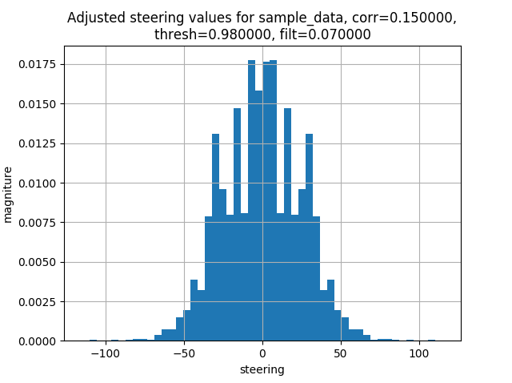

I started with a simple model consisting of nothing more than a  Normalization Step, flatten, then an output layer of Dense(1). The results were predictably bad. The MSE was around 6.0 for the validation data after 3 epochs and the car went about 10 feet and drove off the road. Reducing the learning rate by a factor of 10 made it even worse; the validation MSE was constant around 20.

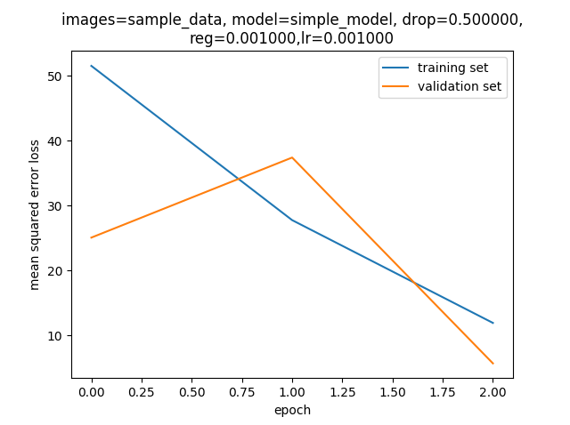

Next, I tried adding cropping to the above model. That elminated any changes to the sky from the analysis and hopefully will improve the model response. In fact, the mse dropped to about 1.6 after 3 epochs and continued to drop to 0.86 after 5 epochs. Car just drove right off the road, however.

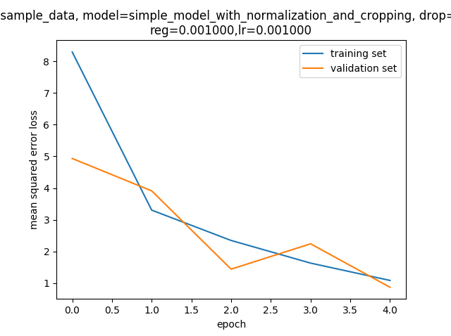

Next we tried a simple convolutional model; using 24 5x5 filters (the first layer of the nvidia model), relu activation, max pooling with a 2x2 filter and dropout of 0.7. The learning rate initially is set to 0.001.

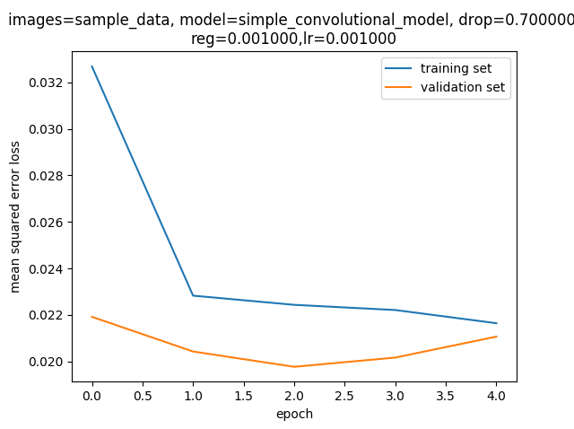

With this model I achieved a validation mse of about 0.02 fairly constant over 5 epochs. The car drove successfully around the track with no problems except for trying to ride the edge just after the bridge. But it drives continuously. 

I saved this as model.h5.sample_simple_conv


To see if adding another layer would improve things, I added the second convolutional layer from the nvidia model (36 5x5 filters) with the same parameters as above. Did not seem to have a noticeable effect on the mse, but the issue when it came off the bridge was lessened; it only rode on the side of the ledge after bridge once, as opposed to three or four times with the single layer.

I saved this as model.h5.sample_simple_conv2

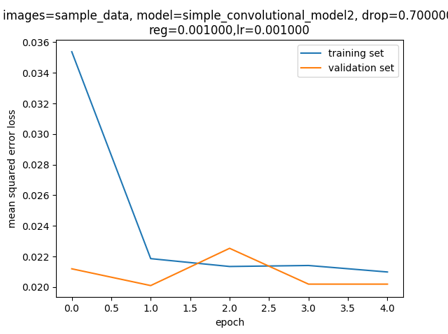

Next, instead of two layers of convolution, we used a single layer and tried inserting a Dense(100) layer between the Flatten and output Dense(1) layer. This is paralleling the Nvidia model, as this is the first dense layer it has This seemed to perform worse than the first two convolutional models, as it stabilized with an mse of about 0.03. Although the ride was much smoother, once it left the bridge the car seemed to "live" on the edge of the road.

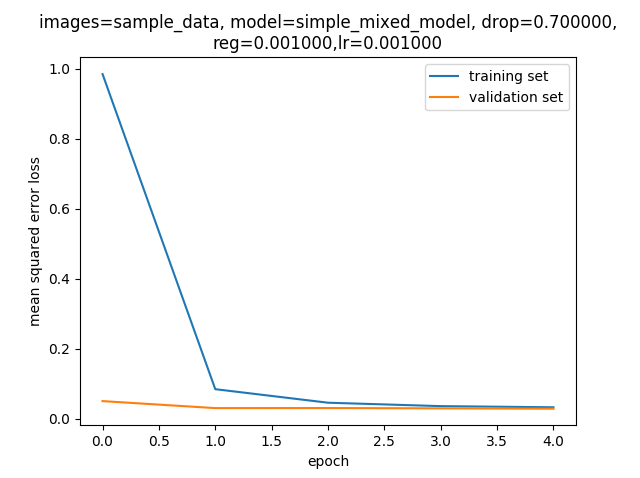

Before we give up on this, let's see what happens if we add an l2 regularization value to the new dense layer. We set the l2 value to 0.001. The result was a validation mse decreasing, but barely. And the car crashed into the front of the bridge. So this is definitely worse

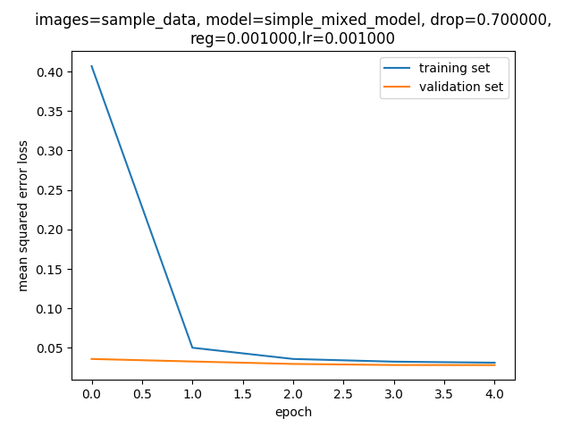

Now let's go back to the best model, which I think is the two layer convolutional model and see if better data will help. We recorded our own data with recovery data:

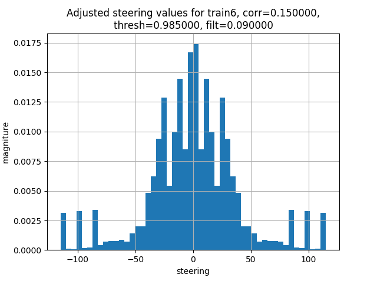

The result was a worse value than before and the mse for the validation data seemed to head downward but bounced around. It drove off the curve before the bridge.

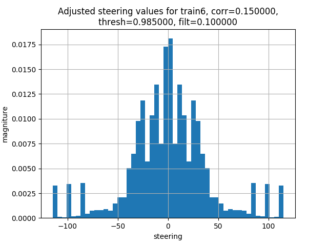
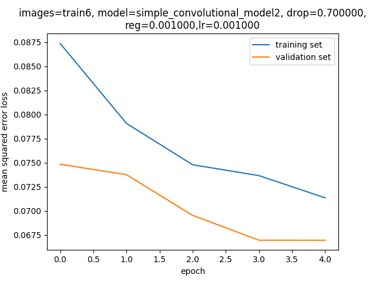


The final step was to run the simulator to see how well the car was driving around track one. There were a few spots where the vehicle fell off the track... to improve the driving behavior in these cases, I reduced the filter to 0.02 and the threshold to 96% and dropout rate to 0.5. 98% worked but resulted in a lot of weaving.

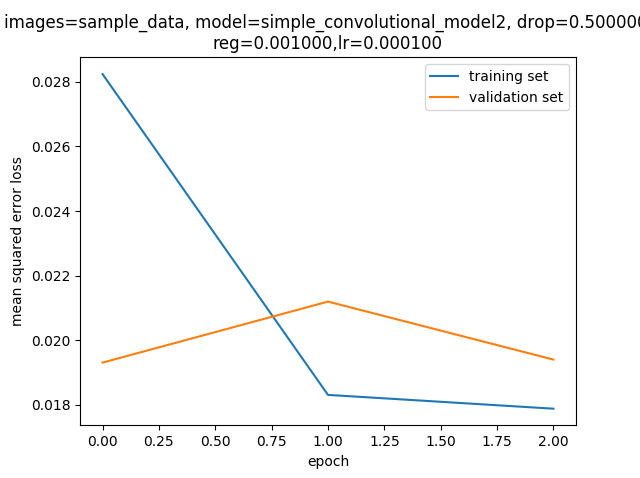


At the end of the process, the vehicle is able to drive autonomously around the track without leaving the road.

####2. Final Model Architecture

The final model architecture (driving_nn.py lines 122-135) consisted of a convolution neural network with the following layers and layer sizes 

Lambda - Normalization layer (x/255/- 0.5)
Cropping2D - Remove the sky from consideration
Convolution2D - 24 5x5 filters
MaxPooling2D - 2x2 pooling
Dropout - keep 70% of the values
Flatten - Flatten the model out
Dense - output the single value

The model generated is [here](model.h5)
####3. Creation of the Training Set & Training Process

I used the sample data for this, as my personal data is not working as well

To augment the data set, I also flipped images and angles thinking that this would allow me to double the amount of data such that if one set of data trains on the right, the flipped images would train on the left and vice versa. I also filtered the data before flipping it by removing about 98% of the points with center steering values between -0.1 and 0.1.

After the collection process, I had 24000 number of data points. After augmentation and final tuning I have 22000 which includes right and left steering values.

I finally randomly shuffled the data set and put 20% of the data into a validation set. 

I used this training data for training the model. The validation set helped determine if the model was over or under fitting. The ideal number of epochs was 3 as evidenced by the validation mse increasing after that. I used an adam optimizer so that manually training the learning rate wasn't necessary
